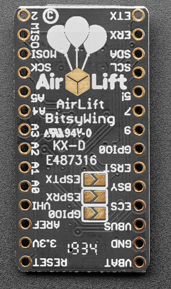
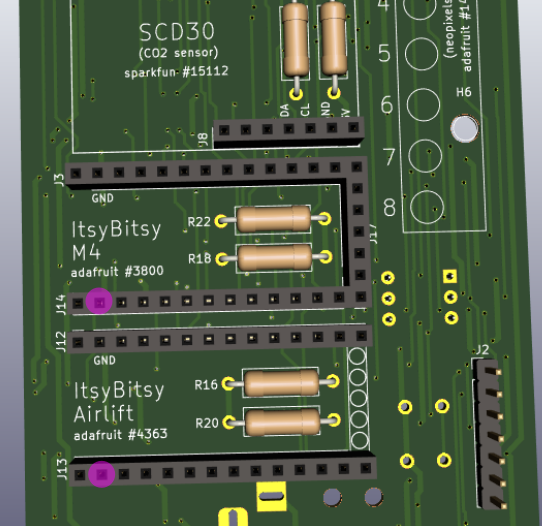
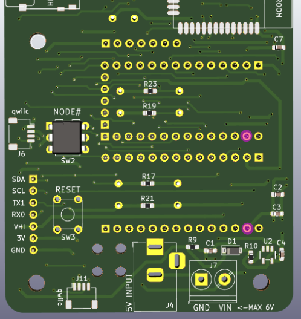

# REV_L

Based around Itsy Bitsy M4 Express and the ESP32 add-on module.

## Assembly

- I'd start with the Lora module on the 'back' of the board -- it's SMT -- and the way I do it is:  first put place solder on one of the pads w/ soldering iron.  Then orient module by associating the 'ANA' marking on the board w/ the 'ANA' pin on the back of the module.  Re-orient / place module while heating the pre-soldered pad until you've got the exact placement right, let the solder cool; then solder the rest of the pads. 

- Then I'd do the microSD holder (optionally). The orientation should be obvious; I do it with a hand soldering iron and touch it up with some solder wick. 

- Then I'd do the Neopixel strip.  (Note to Craig:  oops, I think I forgot to include, in my mailing to you, some of the M2 screws + nuts that I was using to secure it to board!  If you can source some that'd be swell.) You basically orient the strip on the 'front' of the board, and fix it in place with the screws; then you sort of 'flood-solder' the holes on the back of the board that match the neopixel pads (you'll see them).  It might be possible to fix the neopixel strip in place with tape in order to solder, but I don't know if that'll be very mechanically sturdy; best if you can find the M2 screws.  If you don't have any, I can send -- you can still use the board without the strip meanwhile.

- Then I think it's easiest to do the through-hole resistors -- place them on the 'front' of the board. 

- Then, I'd do the through-hole headers ....

- Then, I'd do the node selector thingy -- you put it on the board so that the '0' marking is oriented to the 'top' of the board (i.e. oriented closest tot he Lora module).  NOTE: the pins on that thing are really fragile, so take care when removing it from its package and inserting it into the board

- Then I'd do the barrel jack connector, and the buttons ('reset' and 'button a')

- NOTE: there are some jumper connectors on the back of the ESP32 module that are useful to solder -- they'll allow us to upgrade the firmware on the ESP32 module, and also to reset it when useful:

## Bodges!

Goofed up and didn't connect the 3V input to the ESP32 module to the 3V output from the LDO on the ItsyBitsy M4 module.  Pictured are the pins that (through some bodge wire) need to be connected:

Front view:

Back view:

